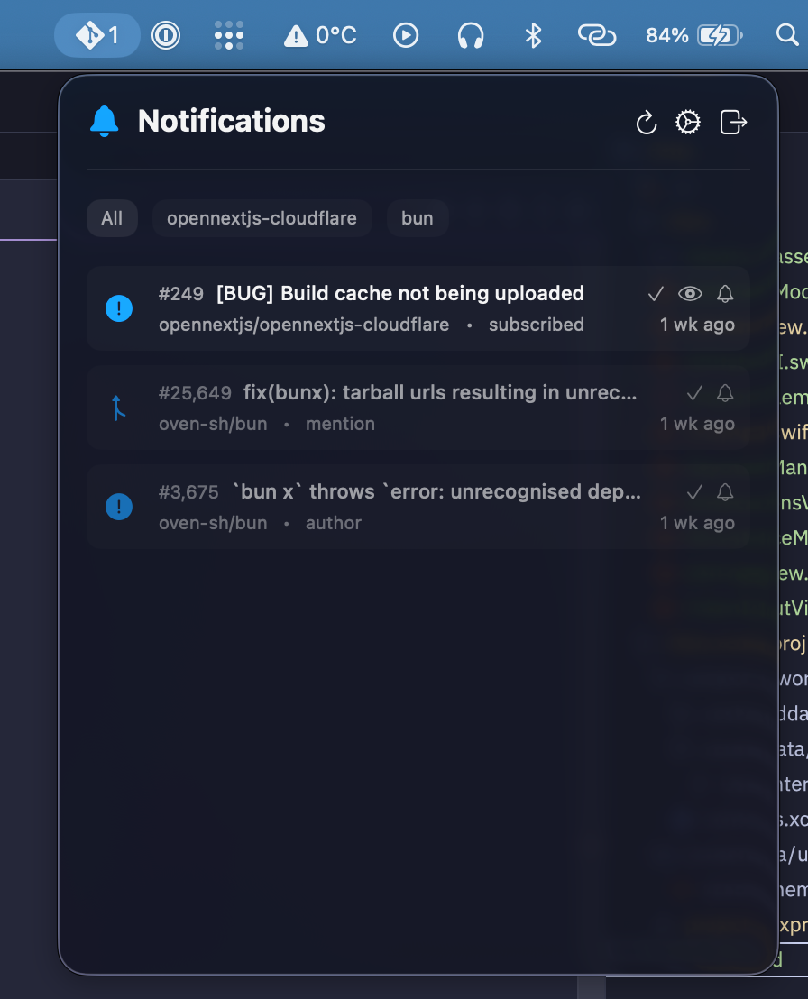

  <h3 align="center">Gitty</h3>

  

    Git notifications in your
     
    MacBook's menu bar.
  

---

Gitty is a lightweight menu bar application for MacOS that provides quick access to your GitHub notifications.

## Features

- View GitHub notifications directly from the menu bar.
- Mark notifications as read (N.B. GitHub API does not support marking as done via third-party apps).
- Open notifications in your default web browser.
- Simple and intuitive interface.
- Store your GitHub token securely in Keychain.
- Auto-refresh notifications on a configurable interval in the background (default: every 1 minute).
- Hiding organizations you don't want to see notifications from (e.g. work).

## Example Screenshots

## AI Usage Disclaimer

This app was developed almost exclusively by heavily supervised LLM agents.
